# **Standalone Radar Control for DCS World**
## **Description**
Standalone Radar Control or **SRC** for short, is a completely free solution and as the title suggests a standalone radar control software used for ATC/GCI/AIC outside the DCS World environment.

# **Documentation**

## **Client**

### **Getting Started**
1) Download the latest [**SRC Release**](https://github.com/Wizxrd/SRC/releases) source.zip.
2) Extract the files from the .zip, place the folder in a location of your choosing.
3) Navigate to the **Client** Folder and run the **Client.exe**.

### **FAQ**
**Q**: What is this?  
**A**: A standalone solution to control players via a radar scope outside of DCS World, most commonly known as **ATC**, **GCI**, and **AIC**.

**Q**: Do I need to have DCS World installed/own any maps?  
**A**: No!

**Q**: Does this use Tacview/DCS-gRPC/Mist/Moose?  
**A**: No, SRC Server version utilizes custom standalone export scripts written in lua.

**Q**: Is this a module for DCS World?  
**A**: No, it is entirely standalone and the only requirements for the client version are listed [**here**](#requirements).

### **Requirements**
- Windows 10 or 11
- Keyboard + Mouse
- Internet
- Latest version of [**.NET 8.0+**](https://dotnet.microsoft.com/en-us/download)

### **Windows**
**Window**|**Description**
----------|---------------
[**CONNECT**](#connect-window) | Where saved server profiles are and starting a connection to a server.
[**MESSAGES**](#messages-window) | Where controllers and players in game can interact via messages.
[**CONTROLLERS LIST**](#controllers-list-window) | List of connected controllers and the side they're on.
[**SETTINGS**](#settings-window) | Quick reference to keybinds and commands.
[**HELP**](#help-window) | Quick reference to keybinds and commands.

#### **Connect Window**
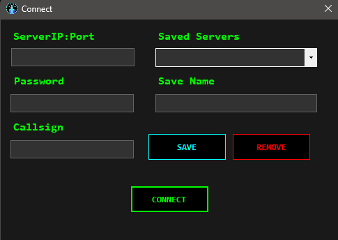
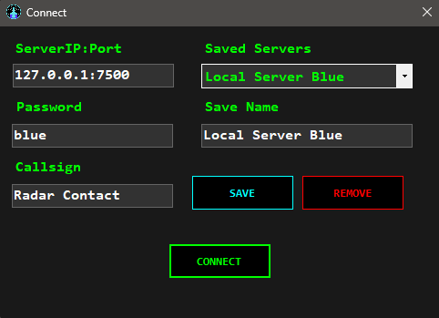
- To open the connect window, click the **CONNECT** button in the top left of the radar scope, indicated with green text. Or use the **LShft + F12** keybind.
- For ease of use between different servers, it is highly recommended to save your server connection settings. To do so, all fields must be filled out and not left blank. Once filled out, you can then press **SAVE**.
- The newly created saved server will then appear as the last in the list within the drop down menu below the **SAVED SERVERS** combo box. 
- To **REMOVE** a server profile, select the one you wish to remove from the **SAVED SERVERS** combo box, then click **REMOVE**.
- The **PASSWORD** you input will determine the side you connect to, server owners should make this public knowledge, by default these passwords are as simple as "blue" and "red".
- To connect, click the **CONNECT** button once you have filled out the **SERVERIP:PORT**, **PASSWORD**, and **CALLSIGN** text boxes.

#### **Messages Window**
- To open the messages window, use the keybind **LShft + M**.
- The **MESSAGES** window provides a quick and easy way to chat with other controllers and players in game.
- To open a specific chat, use the left mouse button on the button located at the top of the messages window.
- Private message buttons can be removed with the right mouse button.
- All, Allies, and Private Messages all have unique sounds to indicate when a message has been sent to that channel.
- When a chat has been sent to a non-active channel, the text for that button will be in orange to indicate an unread message.

Message Type | Description
-------------|------------
[**ALL**](#all-messages) | Messages that all controllers and players in game can see.
[**ALLIES**](#allies-messages) | Messages that only your allies can see for controllers and players in game.
[**Private Messages**](#private-messages) | Private messages between a controller or player in game that no one else can see.

##### **All Messages**
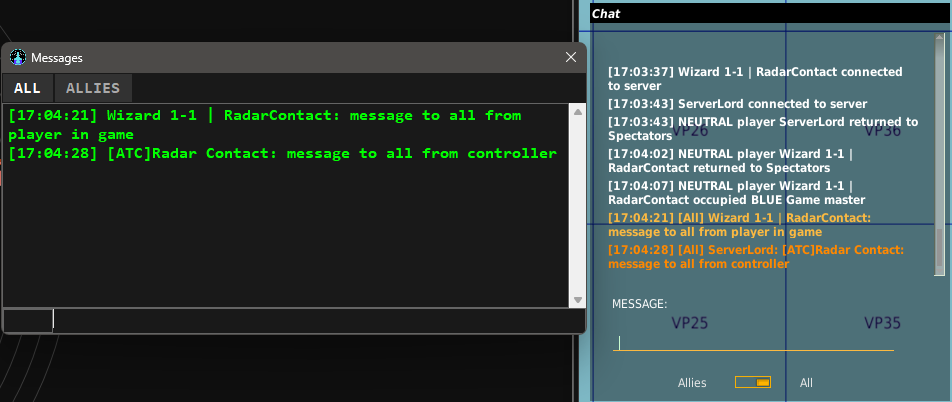
- Messages that players and controllers send to all, will be shown as such for both the controllers message window and the DCS in game chat window.

##### **Allies Messages**
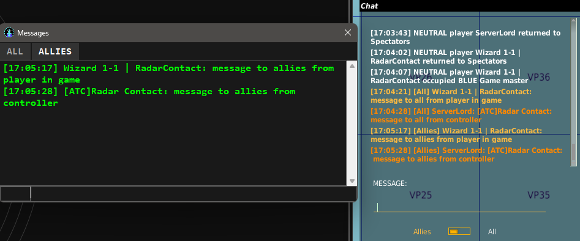
- Message that only players and controllers of a certain coalition can see.

##### **Private Messages**
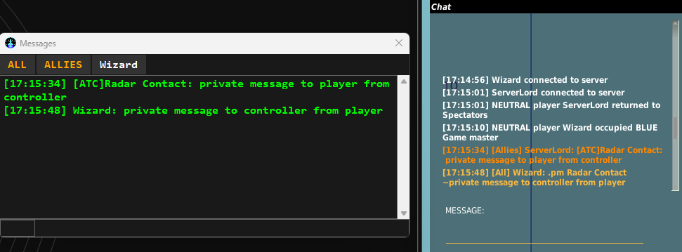
- To start a new private message, type **.pm "CALLSIGN"** into any channel.
- These messages are only only seen between controller-controller and controller-player.
- private messages can be sent to anyone, on anyside.
- For **PLAYERS IN GAME**, they must use **.pm "CALLSING" ~Message**. The **~** indicates the end of the callsign and start of the message to a controller.
- Private messages to controllers from players can also be sent in either the **ALL** or **ALLIES** chat windows.

#### **Controllers List Window**
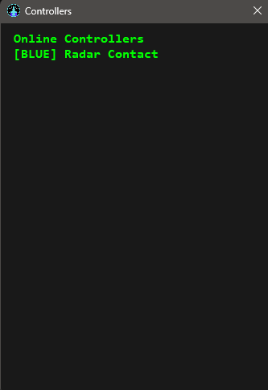
- To open the controllers list use the keybind **LShft + L**
- Shows currently connected controllers indicated by the position they've connected as, **BLUE**, **RED**, or **ADMIN** followed by their callsign used to connect.

#### **Settings Window**
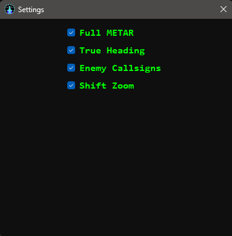
- For now, this is minimal but in the future this will become more detailed.
##### **Full METAR**
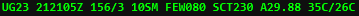

- When enabled you will get the full metar.

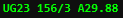
- When disabled, you will only get a partial metar that includes the ICAO, Wind/Speed, and Altimeter.

#### **Help Window**
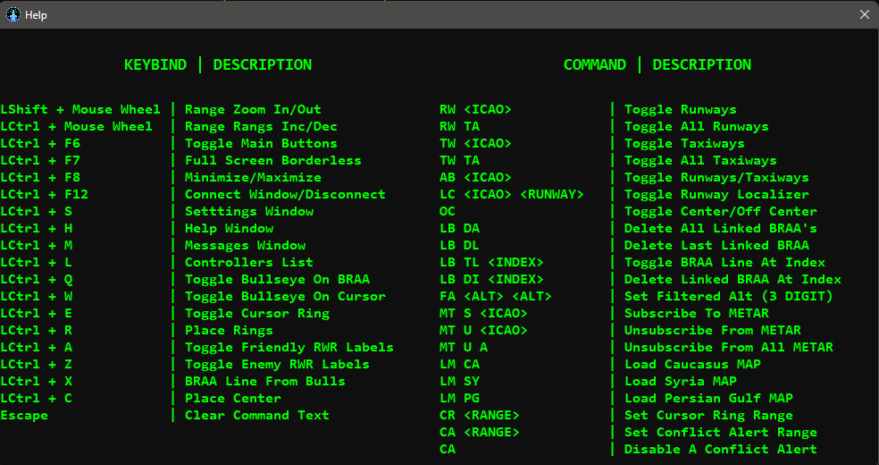
- The help window is a quick reference to keybinds, commands and a brief description.
- Can be opened by clicking the **HELP** button located above the [**MCB**](#main-control-buttons-mcb), or by using the keybind **LShft + H**.

### **Keybinds**
Keybind | Description
--------|------------
LShift + Mouse Wheel | [Range Zoom In/Out](#range)
LCtrl + Mouse Wheel  | [Range Rings Inc/Dec](#range-rings)
LCtrl + F6           | Toggle [**MCB**](#main-control-buttons-mcb)
LCtrl + F7           | Full Screen Borderless
LCtrl + F8           | Minimize/Maximize
LCtrl + F12          | [Connect Window/Disconnect](#connect-window)
LCtrl + S            | [Settings Window](#settings-window)
LCtrl + H            | [Help Window](#connect-window)
LCtrl + M            | [Messages Window](#messages)
LCtrl + L            | [Controllers List](#controllers-list)
LCtrl + Q            | [Toggle Bullseye On BRAA](#braa-with-bullseye)
LCtrl + W            | [Toggle Bullseye On Cursor](#bulls-cursor)
LCtrl + E            | [Toggle Cursor Ring](#cursor-ring)
LCtrl + R            | [Place Rings](#place-rr)
LCtrl + A            | [Toggle Friendly RWR Labels](#air-defense--ship-defense-rings)
LCtrl + Z            | [Toggle Enemy RWR Labels](#air-defense--ship-defense-rings)
LCtrl + X            | [BRAA Line From Bulls](#braa-from-bullseye)
LCtrl + C            | [Place Center](#place-cntr)

### **Commands**
- Type any of the following [commands](#command) followed by pressing **ENTER** on your keyboard.

Command | Description
--------|------------
**RW <**ICAO**>**          | [Toggle Runways](#airbases)
**RW TA**                | Toggle All Runways for the map
**TW <**ICAO**>**            | [Toggle Taxiways](#airbases)
**TW TA**                | Toggle All Taxiways for the map.
**AB <**ICAO**>**            | [Toggle Runways & Taxiways at an airbase](#airbases)
**LC <**ICAO**> <**RUNWAY**>**   | [Toggle Runway Localizer](#airbases)
**OC**                   | [Toggle Center/Off Center](#off-cntr)
**LB DA**                | Delete All Linked BRAA's
**LB DL**                | Delete Last Linked BRAA
**LB TL <**INDEX**>**        | [Toggle BRAA Line At Index](#linked-list)
**LB DI <**INDEX**>**        | [Delete Linked BRAA At Index](#linked-list)
**FA <**ALT**> <**ALT**>**       | [Set Filtered Alt (3 DIGIT)](#filter-altitudes)
**MT S <**ICAO**>**          | [Subscribe To METAR](#metar)
**MT U <**ICAO**>**          | [Unsubscribe From METAR](#metar)
**MT U A**               | [Unsubscribe From All METAR's](#metar)
**LM CA**                | Load Caucasus MAP
**LM SY**                | Load Syria MAP
**LM PG**                | Load Persian Gulf MAP
**CR <**RANGE**>**           | [Set Cursor Ring Range](#cursor-ring)
**CA <**RANGE**>**           | [Set Conflict Alert Range](#conflict-alerts)
**CA**                  | [Disable conflict alert on a contact](#conflict-alert)
**1-9**                 | Without pressing enter and clicking a contact sets a custom [Leader Direction](#leader-direction)
**LL <**Length**>**     | Without pressing enter and clicking a contact sets a custom [Leader Length](#leader-length)

### **Upper Control Buttons**

**Button**|**Description**
----------|---------------
[**CONNECT**](#connect-window) | Used to open the connect window.
**PROFILE** | Not implemented, will be used to edit saved configuration profiles.
[**SETTINGS**](#settings-window) | Not fully implemented at this time, but will be used to change settings within the client.
[**HELP**](#help-window) | Quick reference to [keybinds](#keybinds) and [commands](#commands).

### **Main Control Buttons (MCB)**
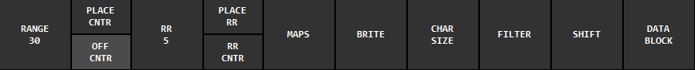
- When within a submenu of an MCB, the currently selected MCB will be highlighted, to select another MCB you must first click the highlighted button to exit the submenu.

**Button**|**Description**
----------|---------------
[**RANGE**](#range) | Controls the scopes zoom in/out.
[**PLACE CNTR**](#place-center) | Allows a secondary center position to be placed by using the left mouse button anywhere within the scope.
[**OFF CNTR**](#off-cntr) | Indicates when you are off of the default center position.
[**RR**](#range-rings) | Range Rings, defines the distance between each range ring, indicated in **Nautical Miles**.
[**PLACE RR**](#place-rr) | Allows a secondary range ring center position to be placed by left clicking anywhere within the scope.
[**RR CNTR**](#rr-cntr) | Indicates when you are off of the default range ring center position.
[**MAPS**](#maps) | Opens the maps submenu to show available maps to display. **MAPS** are based off of real world ARTCC/FIR boundaries.
[**BRITE**](#brite) | Opens the brightness submenu.
[**CHAR SIZE**](#char-size) | Opens the character size submenu.
[**FILTER**](#filter) | Opens the filter submenu.
[**SHIFT**](#shift) | Opens the shift submenu.
[**DATA BLOCK**](#data-blocks) | Opens the data blocks submenu.

#### **RANGE**
1) Holding **LShift + Mouse Wheel** to zoom in/out from the center of the scope.
2) Use the left mouse button on the **RANGE** button, then use your mouse scroll wheel while the cursor is within the button to zoom in/out from the center of the scope.

#### **PLACE CNTR**
1) Use the left mouse button on the **PLACE CNTR** button, then click anywhere within the scope to place a new center.
2) Use the command **LCtrl + C** to place a new center based off where the scopes center is currently looking.

#### **OFF CNTR**
1) If the button is in dark color, you're currently at the default center.
2) If the button is highlighted in a light color, it indicates you are currently off of the default center.
3) If a secondary center position has been placed, you can use the left mouse button on this button to toggle between the default and placed center positions.

#### **RANGE RINGS**

1) Holding **LShift + Mouse Wheel** to increase/decrease the distance between range rings.
2) Use the left mouse button on the **RR** button, then use your mouse 
scroll while the cursor is within the button to increase/decrease the range between rings.

#### **PLACE RR**
1) Use the left mouse button on the **PLACE RR** button, then click anywhere within the scope to place the range rings at a new location.
2) Use the command **LCtrl + R** to place the rings at a new location based off where the scopes center is currently looking.

#### **RR CNTR**
1) If the button is dark in color, you're currently at the default location of the range rings.
2) If the button is a highlighted color, the location of the range rings is off of the default center location.
3) If a secondary location for range rings have been placed, Use the left mouse button on this button to toggle between the default and placed range ring positions.

#### **MAPS**
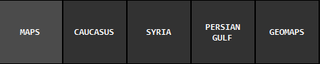
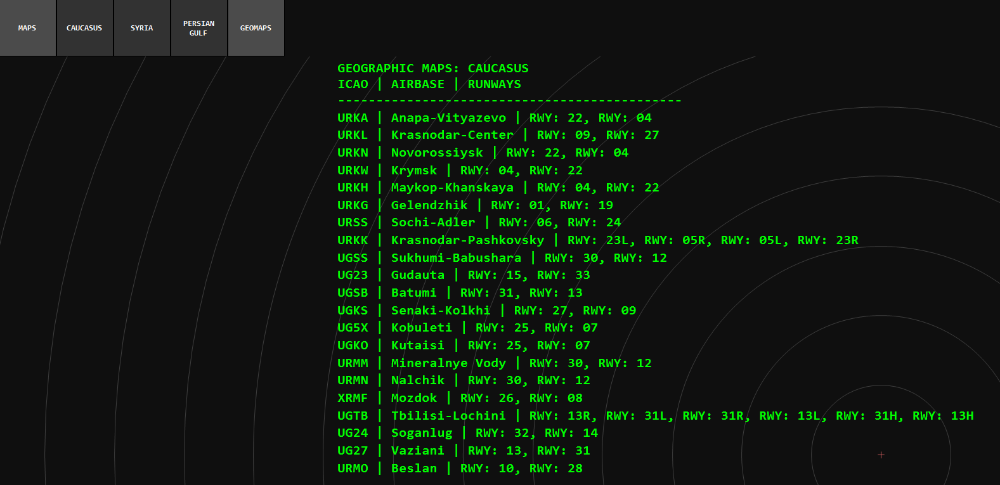
1) Within the **MAPS** submenu, you will be preseneted with options to select a map. To select a map, Use the left mouse button on the map you wish to display. Currently these are **Caucasus**, **Syria**, and **Persian Gulf**. More maps will come in time, while also letting them be customized by the controller or server owners.
2) Additionally you will see a **GEOMAPS** button, left clicking this button will display within the radar scope a quick look list of airports indicated by **ICAO**, **AIRBASE**, and **RUNWAYS**. this is useful for the **AB**, **RW**, **TW**, and **LC** commands.

#### **BRITE**
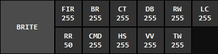
- To change the brightness, use the left mouse button on the button you wish to change the brightness of, then use your mouse scroll while the cursor is within the button to increase/decrease the brightness.

**Button**|**Description**
----------|---------------
[**SC**](#sectors) | Changes the brightness of the ARTCC/FIR sectors
[**RR**](#range-rings) | Changes the brightness of the range rings.
[**BR**](#braa) | Changes the brightness of the BRAA line & Bullseye on cursor.
[**CMD**](#command) | Changes the brightness of the command text.
[**CT**](#contacts) | Changes the brightness of the contact dots.
[**HS**](#history) | Changes the brightness of the history dots.
[**DB**](#data-blocks) | Changes the brightness of a contacts datablock.
[**VV**](#velocity-vectors) | Changes the brightness of a coontacts velocity vector.
[**RW**](#airbases) | Changes the brightness of runways.
[**TW**](#airbases) | Changes the brightness of taxiways.
[**LC**](#localizers) | Changes the brightness of localizers.

#### **CHAR SIZE**
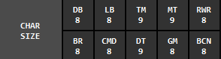
- To change the character size, use the left mouse button on the button you wish to change the character size of, then use your mouse scroll while the cursor is within the button to increase/decrease the character size.

**Button**|**Description**
----------|---------------
[**DB**](#data-blocks) | Change the character size of datablocks.
[**BR**](#braa) | Change the character size of the BRAA line & Bullseye on cursor.
[**LB**](#linked-list) | Change the character size of the linked BRAA list.
[**CMD**](#command) | Change the character size of the command text.
[**TM**](#time) | Change the character size of the mission & game run time.
[**DT**](#date) | Change the character size of the mission date.
[**MT**](#metar) | Change the character size of METAR's
[**GM**](#maps) | Change the character size of the GEOMAP.
[**RWR**](#air-defense--ship-defense-rings) | Change the character size of the RWR air defense & ship labels.

#### **FILTER**
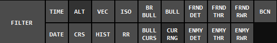
- To toggle a **FILTER**** on/off, use the left mouse button on the button. when highlighted it will indicate the feature is enabled. if dark in color the feature is disabled.
- **FA** Filter Altitude is the only exception, being always enabled. If clcked, it will show the minimum/maximum filtered altitude blocks in hundreds of feet.

**Button**|**Description**
----------|---------------
[**TIME**](#time) | Toggle the display of mission & game run time
[**DATE**](#date) | Toggle the display of the mission date
[**VEC**](#velocity-vectors) | Toggle contacts to display a velocity vector line
[**RR**](#range-rings) | Toggle the display of the range rings.
[**HIST**](#history) | Toggle contacts to display a history track
[**ISO**](#isolines) | Toggle the display of isolines
[**ALT**](#filter-altitudes) | When clicked, shows the filtered altitude block in hundreds of feet
[**CRS**](#crosshair) | Toggle the display of the crosshair located in the center of the scope
[**BR BULL**](#braa-from-bullseye) | Toggle the display of bullseye reference after the BR text
[**BULL CURS**](#bulls-cursor) | Toggle the display of the bullseye reference linked to the mouse cursor
[**BULL**](#bullseye) | Toggle the display bullseye for the side you're connected to
[**CURS RING**](#cursor-ring) | Toggle the display of the cursor ring linked to the mouse cursor
[**FRND DET**](#air-defense--ship-defense-rings) | Toggle the display of friendly detection rings
[**ENMY DET**](#air-defense--ship-defense-rings) | Toggle the display of enemy detection rings
[**FRND THR**](#air-defense--ship-defense-rings) | Toggle the display of friendly threat rings
[**ENMY THR**](#air-defense--ship-defense-rings) | Toggle the display of enemy threat rings
[**FRND RWR**](#air-defense--ship-defense-rings) | Toggle the display of friendly RWR air defense & ship labels
[**ENMY RWR**](#air-defense--ship-defense-rings) | Toggle the dispaly of enemy RWR air defense & ship labels

#### **SHIFT**
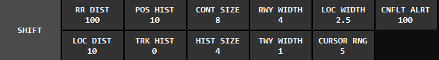
- to utilize a shift button, use the left mouse button on the button and then while your mouse cursor is within the button use the mouse scroll wheel to increase/decrease the data.

**Button**|**Description**
----------|---------------
[**RR DIST**](#range-rings) | Change the maximum range for rings to be displayed in nautical miles.
[**LOC DIST**](#localizers) | Change the length of localizer lines in nautical miles.
[**POS HIST**](#history) | Change the maximum amount of position history dots for contacts to display.
**TRK HIST** | Change the amount of times a contact will move before a position history dot is updated behind the contact.
[**CONT SIZE**](#contacts) | Change the size of the contact dots.
[**HIST SIZE**](#history) | Change the size of the history dots.
[**RWY WIDTH**](#airbases) | Change the width of runway lines.
[**TWY WIDTH**](#airbases) | Change the width of taxiway lines.
[**LOC WIDTH**](#localizers) | Change the width of localizer lines.
[**CURSOR RNG**](#cursor-ring) | Change the radius of the cursor ring on the mouse cursor.
[**CFLCT ALRT**](#conflict-alerts) | Change the volume on conflict alerts.

#### **DATA BLOCK**
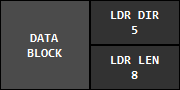
- To use a data block button, use left mouse button on the button then use the mouse scroll wheel to increase/decrease the data.

**Button**|**Description**
----------|---------------
[**LDR DIR**](#leader-direction) | Sets all contacts to a specifc direction, this will not effect contacts given a custom leader direction.
[**LDR LEN**](#leader-length) | Sets all contacts leader lines to a specific length. Similar to leader direction, this will not effect contacts given a custom leader length.

### **Scope Reposition**
1) To reposition where the scope is looking, click and hold the right mouse button, then move your mouse.
2) If a secondary center position has been placed with [**PLACE CNTR**](#place-center), you can click this button to toggle back and forth to reposition.

### **Cursor Ring**
- The cursor ring is a ring that moves around the scope centered on your cursor, with a radius set in Nautical Miles.
- Can be toggled off via the [**FILTER**](#filter) submenu, or with **LCtrl + Z**.
- The radius of the cursor ring can be set via the [**SHIFT**](#shift) submenu, or with the command **CR <**DIST**>**.

### **BRAA**
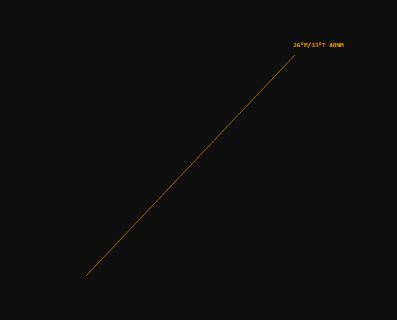
- Should be noted that all BRAA information only provides **BEARING & RANGE**
- To start a **BR**, click and hold the left mouse button then move your mouse around the scope.
- **BR** text is always indicated with an **orange color**

#### **BR From Bullseye**
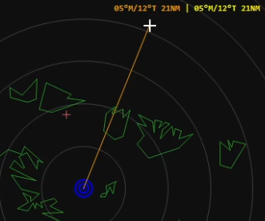
- **BR** Line from the bullseye, before or after starting a **BR** use **LCtrl + X** to snap the starting point of your **BR** line from the bullseye.

#### **BR With Bullseye**
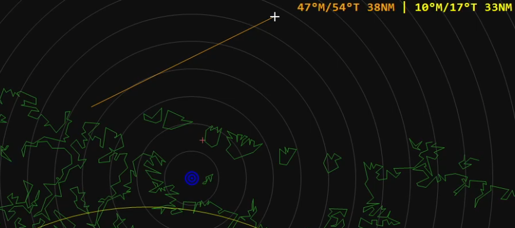
- **BR** with bullseye reference, Similar to [**BR**](#braa), click and hold the left mouse button then move your mouse around the scope.
- This can be toggled within the [**FILTER**](#filter) submenu.
- Bullseye information is indicated in a **yellow color**.

#### **Linked BRAA**
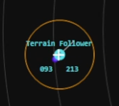  
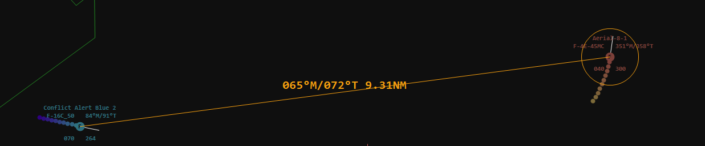  
  
- Linked **BR** will automatically be added to the Linked **BR** List located in the right upper corner underneath the mission date.
- Initiating a Linked **BR** will show an **ORANGE** ring around the contact for indication a link has started.
- Ending a linked **BR** on a contact will also show an orange ring around the intended contact.
1) use **LCtrl + Left Mouse Button** to click on a contact and then release the keybind. Then Use **Left Mouse Button** on the second contact initiate the Linked **BR**.
- or
2) use **LCtrl + Left Mouse Button** continue to hold **Left Mouse Button**, then release it over the second contact to initiate a Linked **BR**.
#### **Linked List**
- List of all linked **BR**'s between contacts with the ability to toggle the connecting line between contacts.
1) To toggle the connecting line between contacts on or off, use left mouse button on the intended item in the list.
2) To remove a link entirely from the list and the connecting line, use right mouse button on the intended item in the list.

### **Bulls Cursor**
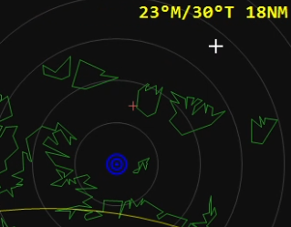
- Provides **BEARING & RANGE** to the bullseye.
- Bullseye information is always displayed with a **yellow color**
- Bulls cursor is a constant reference to your connected sides bullseye that follows your cursor around the scope.
- This can be toggled within the [**FILTER**](#filter) submenu.
- Only available when fully connected to a server.

### **Contacts**
- If you are reading this, at this time further data block customization is limited, contacts will eventually have a global and local properties window.
#### **Color Classifications**
##### **Friendly Player**
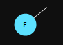
- Friendly contacts are indicated with a **bright light blue color**.
##### **Friendly AI**

- Friendly contacts are indicated with a **dim light blue color**.
##### **Enemy Player**
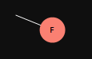
- Enemy contacts are indicated with a **bright light red color**.
##### **Enemy AI**
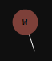
- Enemy contacts are indicated with a **dim light red color**.
##### **Neutral AI**
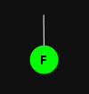
- Neutral AI contacts are indicated with a **Bright green color**.

#### **Data Blocks**
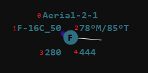

##### **Data Block Fields**
Field | Information 
------|------------------
**0** | [**Callsign**](#callsign)
**1** | [**Type**](#type)
**2** | [**Heading**](#heading)
**3** | [**Altitude**](#altitude)
**4** | [**Ground Speed**](#ground-speed)

##### **Callsign**
- Callsigns will show a connected player username, or if an AI the unit name.
##### **Type**
- Type will be the dcs unit typeName of the aircraft.
##### **Heading**
- Shown is Magnetic then True heading.
##### **Altitude**
- Indicated in **hundreds of feed**.
##### **Ground Speed**
- Indicated in **Knots** parallel to the ground.

#### **Leader Direction**
- depicted below is a data block in leader direction number 9, NE.
- If a custom direction is given, it will be unchanged by the [**DATA BLOCK**](#data-block) button.

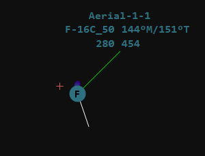

1) To set a custom leader direction of a data block per contact, type any of the **Numbers** below, without pressing enter, then click a contact.

Number | Location
-------|----------
**1** | **SW**
**2** | **S**
**3** | **SE**
**4** | **W**
**5** | **CENTER**
**6** | **E**
**7** | **NW**
**8** | **N**
**9** | **NE**

#### **Leader Length**
- Leader lines extend from the contact, to the data block in positions other than number 5, center.
- Lengths are avaiable from 1-10.
1) To set a custom leader length per contact, use the command **LL <**Length**>**, without pressing enter then click a contact.

#### **Type Modifier**
Type | Description
-----|------------------
**A** | Attack
**B** | Bomber
**C** | Cargo
**F** | Fighter
**K** | Tanker
**R** | Recon
**W** | AWACS

#### **Velocity Vectors**
- Velocity Vectors are projected along the contacts true heading track and extend and retract based upon the contacts ground speed.
- Can be toggled on/off in the [**FILTER**](#filter) submenu.

#### **History**
- History is a track of the last known positions of the contact.
- Can be toggled on/off in the [**FILTER**](#filter) submenu.
- More or less history can be displayed via the [**SHIFT**](#shift) submenu.

#### **Conflict Alerts**
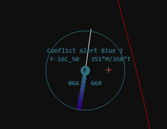  
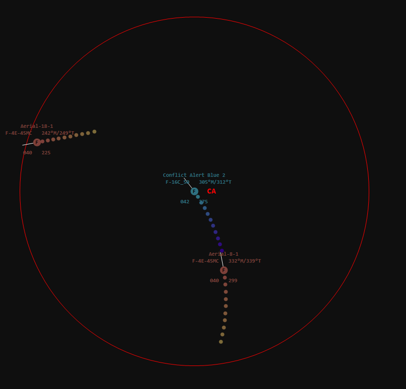
- Conflict alerts can only be added to a friendly contact and will only indicate a conflict when an enemy contacts enters within the radius set for the alert.
- Conflict alert rings are in Nautical Miles.
1) Add a conflict alert to a contact by using the command **CA <**RANGE**>**.
2) The command will await for you to click the intended contact, once a contact is clicked a ring the same color of the contact will appear around it.
3) When a conflict arises, the ring will turn a **bright red color**, red text **CA** will appear in to the right of the contact and an audible tone will start playing.
3) To toggle the conflict alert audio for a contact, use left mouse button on the contact.
4) To remove a conflict alert for a contact, use the command **CA**. The command will await for you to click on the contact you intended to remove conflict alerts for.

#### **Filter Altitudes**
- In the example below, the filter altitude is set from **002** to **040**.

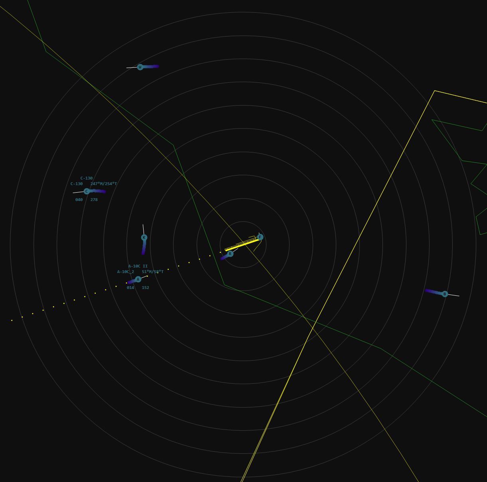
- In hundreds of feet, above sea level.
- Filter altitudes can be set with the command **FA <**ALT**> <**ALT**>**, where the first alt is the minimum and second is the maximum.
- Contacts above the minimum and below the maximum will be shown.

### **Airbases**
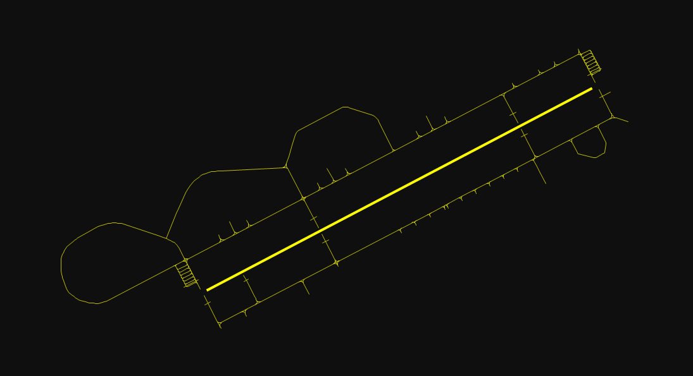
- Airbases can be displayed with the command **AB <**ICAO**>**, it will show all runways and taxiways.
- To toggle the display of all runways for an airbase you can use the command **RW <*ICAO**>**.
- To toggle the displau of taxiways for an airbase you can use the command **TW <**ICAO>**.
- The length and width of the runways & taxiways can be changed in the [**SHIFT**](#shift) submenu.

#### **Localizers**
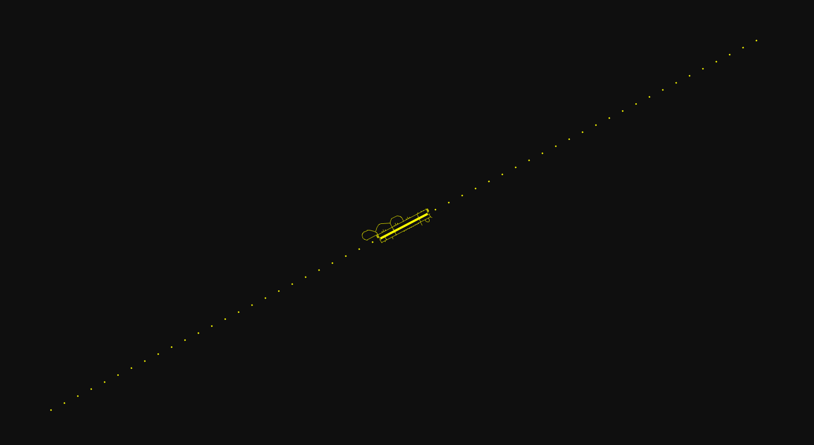
- To toggle the display of a localizer for a runway, use the command **LC <**ICAO**> <**RW**>**.
- The length and width of the localizers can be changed in the [**SHIFT**](#shift) submenu.

### METAR
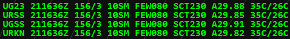
- METAR's are available to activate for airbases only.
- Because DCS, winds, visibility, clouds, temperature, and dew point are the same all over the map, the Altimeter however is accurate to the location. Visbility is also weird, even in cases of heavy rain, the visibility remains at 10SM.
1) To subscribe to a metar at an airport, use the command **MT S <**ICAO**>**.
2) To unsubscribe from a metar, use the command **MT U <**ICAO>**.
3) You can also unsubscribe from all METAR's using the command **MT U A**.

### **Air Defense & Ship Defense Rings**
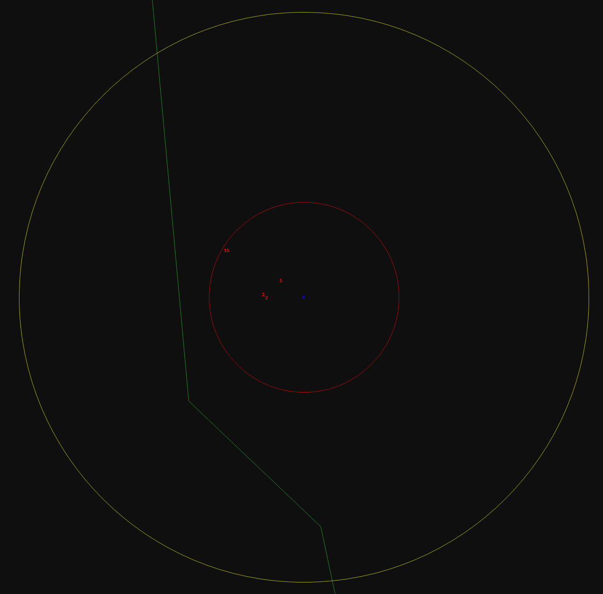
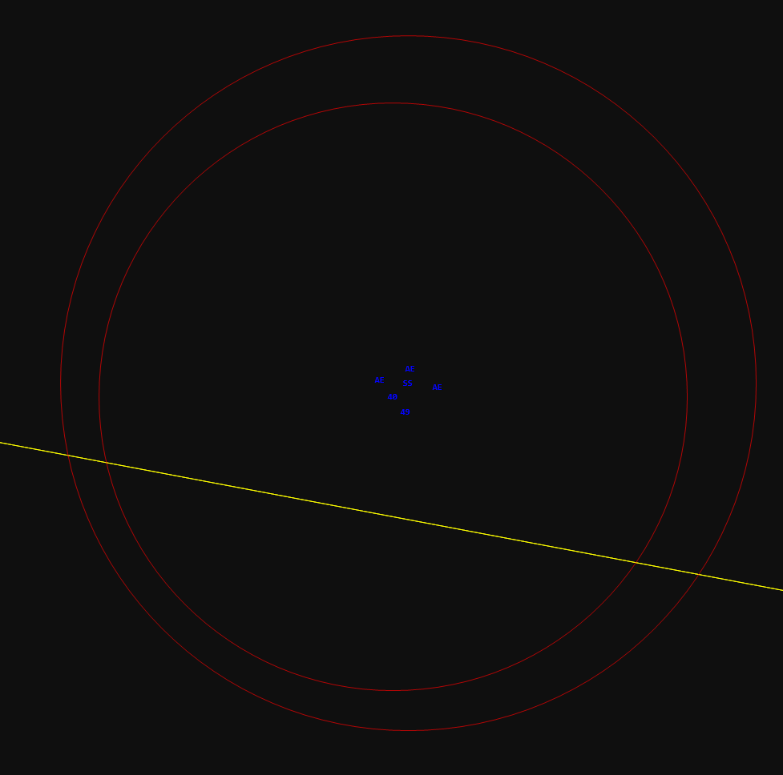
- Detection rings indicated with a **bright yellow color**
- Threat rings indicated with a **bright red color**
- RWR Labels, are at the location of the position of the defense. Indicated with NATO type identifiers. A **Blue** color indicates friendly, a **RED** color indicates enemy.
1) Using left mouse button on the RWR label, you can toggle the display of individual detection rings.
2) Using right mouse button on the RWR label, you can toggle the display of individual threat rings.
3) In the [**FILTER**](#filter) submenu, you can also toggle all friendly and enemy detection/threat rings, and RWR labels.
4) You can also use the commands **LCtrl + W** to toggle all friendly RWR labels and **LCtrl + S** to toggle all enemy RWR labels.

### **Time & Date**
#### **Time**
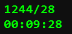
- Mission time is located in the upper left corner below the [**MCB**](#main-control-buttons-mcb).
- Mission run time since mission start is located in the upper left corner, below the mission time.
#### **Date**
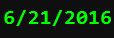
- Mission Date is located in the upper right corner.

### **Isolines**
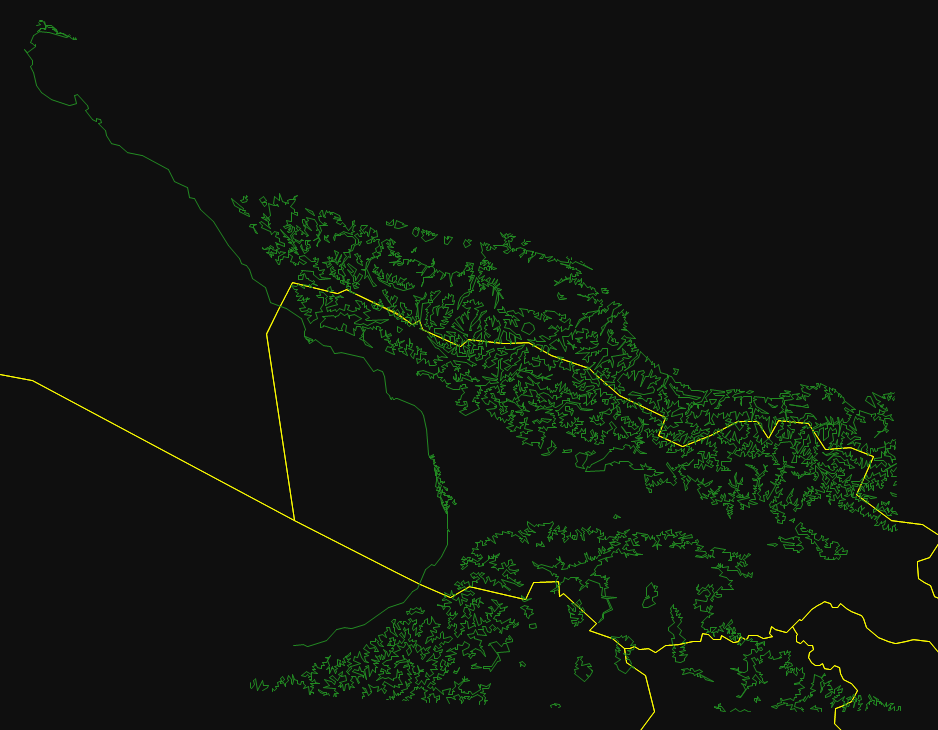
- Isolines are displayed in a **green color** and indicate differences in terrain height.
- To keep performance up, the height differences depecited for each map is slightly different.
- DCS provides no proper way of exporting terrain height in a proper manner, therefor the data is based off real world current day data.
- Caucasus terrain heights between lines is around 1500M.
- Syria and Persian Gulf terrain heights between lines is around 700M.

### **Crosshair**
- The crosshair is located directly at the center of the scope, and is useful when using the place center and place rings keybinds.

### **Bullseye**
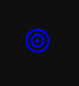
- Bullseye is indicated with a center dot and two rings, in the color of the side you're connected to.

### **Sectors**
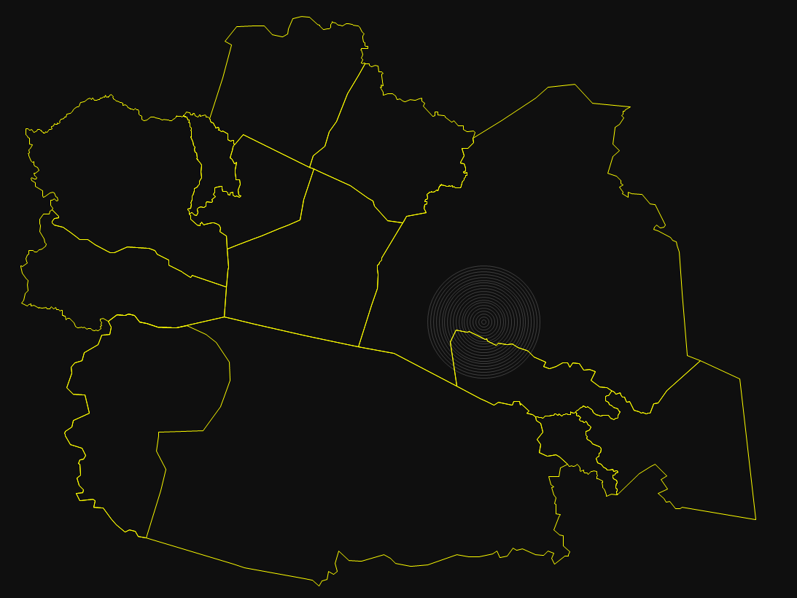
- Based on real world ARTCC/FIR boundaries.
- Displayed in a **yellow color**.

### **Command Area**
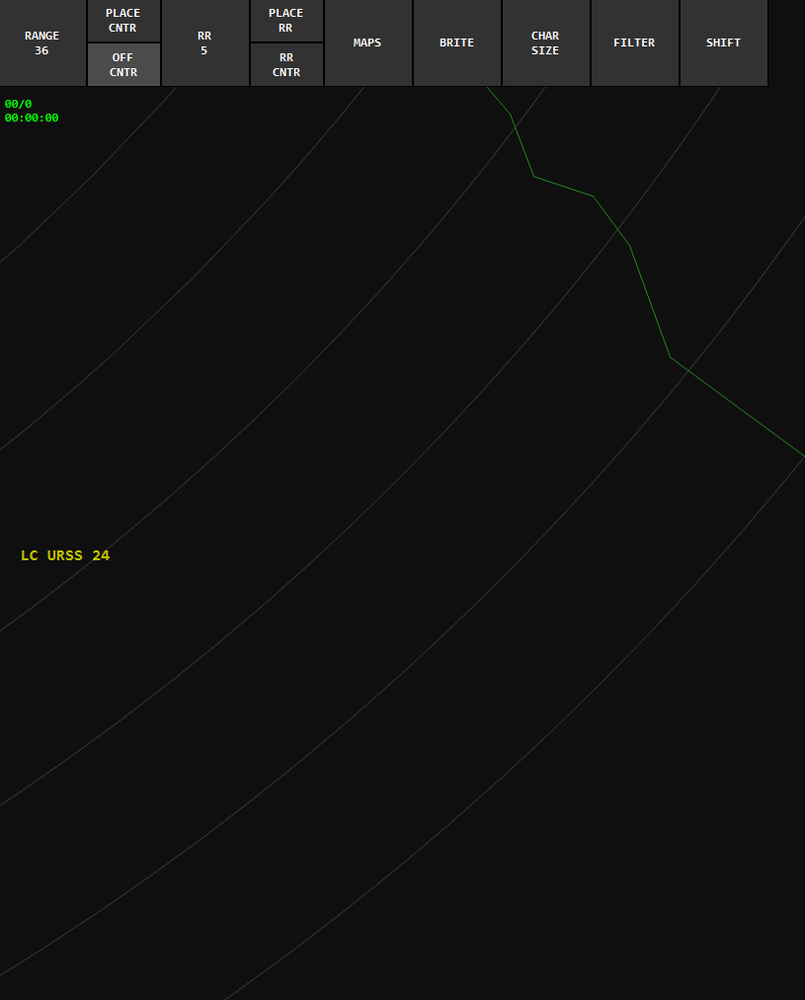
- Located on the left side edge of the screen centered to be always in the middle.
- Displayed in a **yellow color**